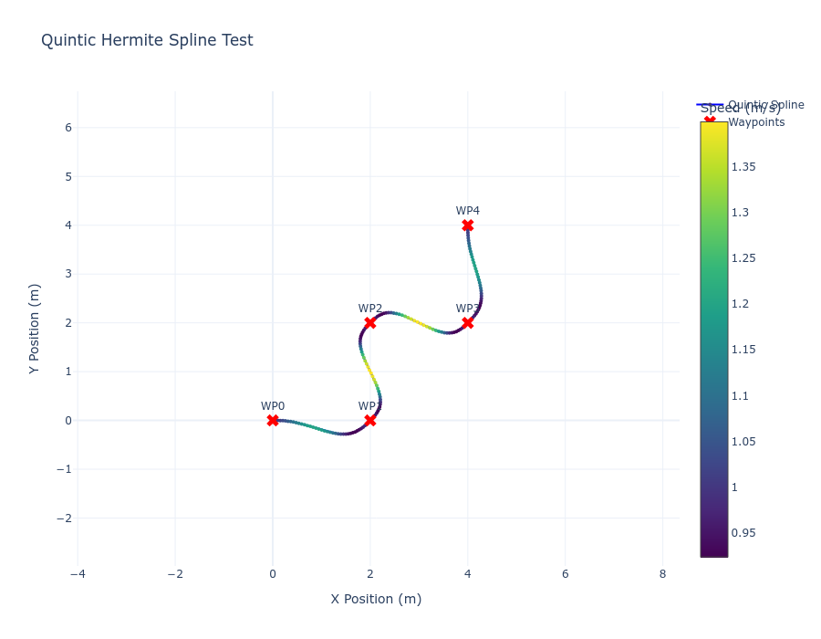
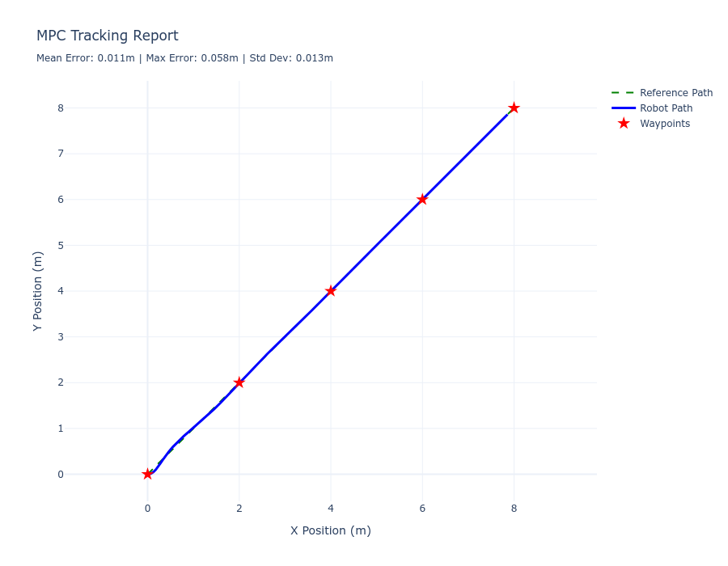
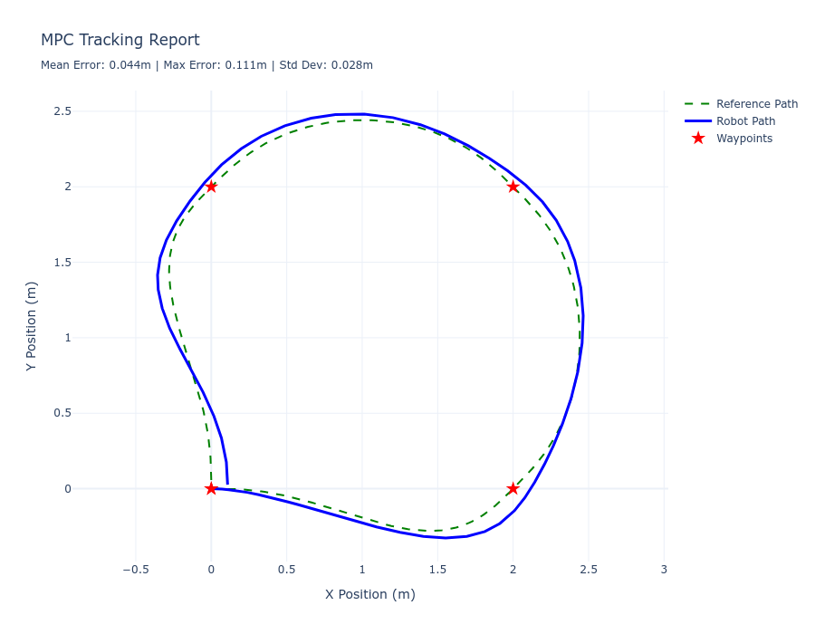
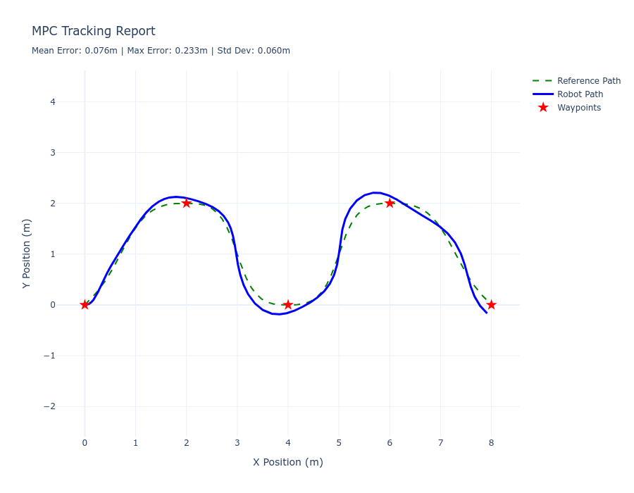
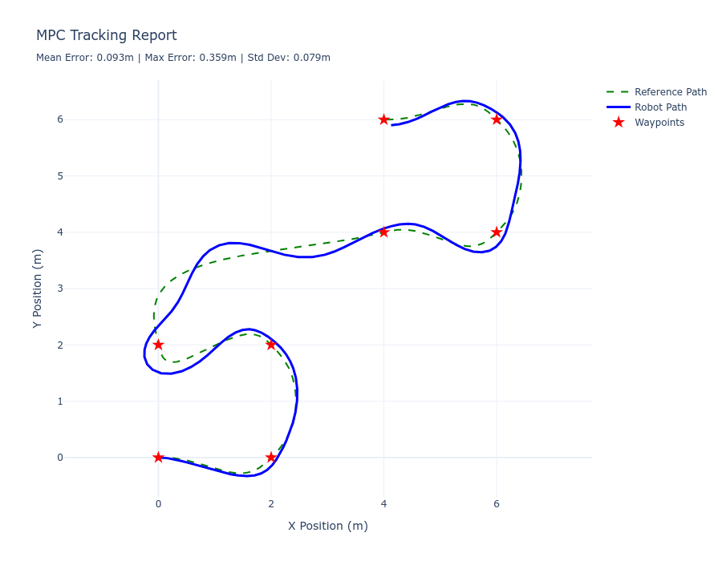

# GlobalDrive

**GlobalDrive**
Is a ROS2 project that simulates the motion of a differntial drive robot, all the way from planning to control. 

This Project leverages the existing turtlebot3 waffle gazebo simulation setup, inorder to streamline the process.

---
# Project requirements

| # | Requirement | Description | Installlation guide | notes | 
|---|-------------|-------------| -------------| ----------- | 
| 1 | ROS 2 Humble (or later) | Provides the middleware, colcon build tooling, and message runtime. | [Install ROS 2 Humble](https://docs.ros.org/en/humble/Installation.html)
| 2 | GZ harmonic| Needed for running turtlebot3 waffle world simulations. | [install GZ harmonic (source install for humble)](https://gazebosim.org/docs/harmonic/install) | Additionally also install the ros depencies for gz harmonics, eg ros-gz-bridge, etc. 
| 3 | TurtleBot3 packages | Supplies robot description, navigation stacks, and launch files. |**follow steps mentioned below** 
| 4 | Python 3.10+ | Used for control, planning scripts, and utilities. | - default - 
| 5 | cvxpy | Needed for running convex optimisation for the mpc controller. | `pip install cvxpy `
| 6 | numpy 2.0+ | This is used to handle the matrices and its operations. | `pip install numpy`
| 7 | plotly | used for visualising the results and other graphs directly (can be used for recreating the graphs presented). | `pip install plotly`
| 8 | RViz (2) | Normally installed alongside with ROS2 | follow ros2 installation guide for rviz. 

---
# Installation

1). Create a workspace for the project and cd into it

```bash
mkdir globalDrive
cd globalDrive
```

2). clone the src folder.\
[**note** the turtlebot setup and will be done in the next step.]

```bash
#inside globalDrive
git clone https://github.com/AkshayArjun/globalDrive.git
```
3). next inside src run 
```bash
 git clone -b new_gazebo https://github.com/azeey/turtlebot3_simulations.git
 # this installs the turtlebot for gz sims
 ```
 4). in your root directory run
 ```bash
colcon build --packages-selct gDrive --symlink-install
colcon build --packages-select turtlebot3_simulations --symlink-install

source install/setup.bash
```
5). run rosdep to handle all dependencies

# usage:
## mission planning 
Inside gDrive package find the file name **mission.csv** under ```/gDrive/resources```
use this file to add the waypoints to the global planner

## running the simulation

```bash
#simply use the launch file : 
ros2 launch gDrive simulation.launch.py 
```
---
# results 

### Spline generation : 



### Lpv - mpc controller output : 
#### 1). Straight line:


#### 2). Square: 


#### 3). ZigZag:


#### 4). Random set of points: 

[**comment:** It should be noted that the controller isn't best tuned and further tunign can improve the performance ]

### Demo video :

#### click here for the demo run [video](media/lpv_mpc_demo.webm)


# License 
This project is licensed under the GNU GPL v3 [LICENSE](LICENSE)
